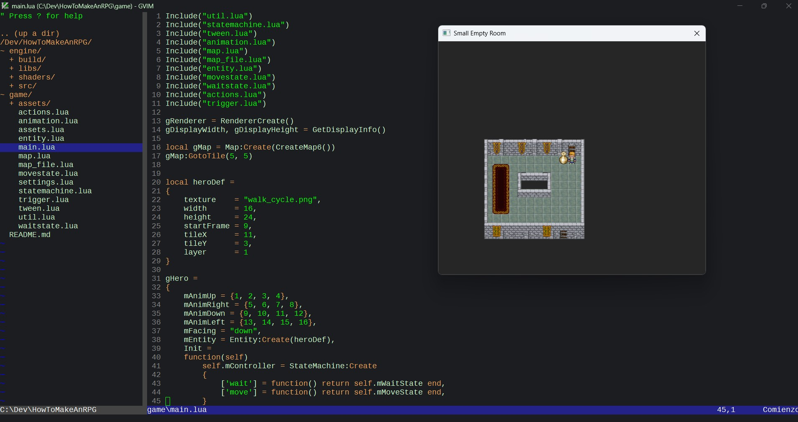

2D Game Engine Proyect Inpired by the HowToMakeAnRPG https://howtomakeanrpg.com/

This proyect is a Small 2d C++ d3d11 engine that uses lua for gameplay code

Installation:

    -   git clone https://github.com/manuelcabrerizo/HowToMakeAnRPG.git
    -   cd HowToMakeAnRPG
    -   cd engine
    -   cd src
    -   build.bat
    -   ..\build\win32_engine.exe
